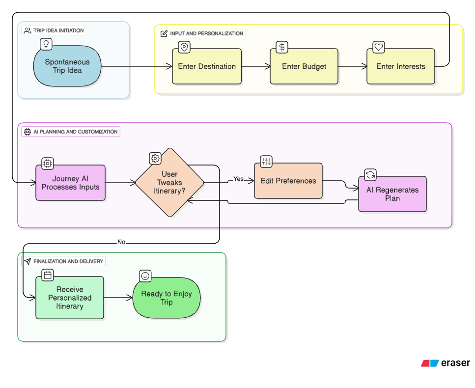

# Journey AI

It is late on a Friday and you are all set for the weekend. Then your school friends call and say they want to go on a two-day trip starting tomorrow. What do you do? Spend three or four hours hunting for hotels, reading scattered reviews, and building a schedule by hand? 

Here’s the thing: nobody has time for that.

Meet Journey AI. It is a travel planner that turns a few quick inputs into a ready-to-go itinerary. Tell it where you want to go, how much you want to spend, and what you care about—food, history, adventure, or just relaxing—and it builds a day-by-day plan that you can actually use.

**A Note to the Development Team (PORTIA AI)**: A significant part of this project involved identifying and building a solution for a critical data-passing bug within the Portia AI SDK. The full technical breakdown can be found in the "Key Challenges & Solutions" section.



### See My Project Live\!

  * **Try the Live Website:** https://github.com/furyfist/Journy-AI
  * **Watch a Video Demo:** [Demo](https://drive.google.com/drive/folders/1A57qJ1R8wlIyY5BhsNZsVMN_5OsQB9II?usp=sharing)
  * **Read My Planning Documents:** [Document](https://drive.google.com/drive/folders/1A57qJ1R8wlIyY5BhsNZsVMN_5OsQB9II?usp=sharing)

### My Technology Stack (The tools I used to build Journey AI)

  * **Frontend (The part you see):** I used React to build the interactive and user-friendly website that you click on and use.
  * **Backend (The brain of the operation):** I used Python with FastAPI to build the server that works behind the scenes, takes your requests, and talks to the AI.
  * **Artificial Intelligence (The magic):** I used the Google Gemini Pro API and the Portia AI SDK to understand your travel wishes and generate the smart, human-like itinerary.
  * **Database (Where we store information):** I used PostgreSQL to safely store user accounts and all the travel plans that have been created.
  * **Deployment (How I put it on the internet):** I used Docker to package my application so it can run anywhere, and I hosted it on AWS (Amazon Web Services).
  * **Styling (Making it look good):** I used Tailwind CSS to design the website and make sure it looks great on both computers and phones.


### Getting Started: Setting Up the Project Locally

Follow these instructions to get a copy of Journey AI running on your local machine for development and testing purposes.

#### Prerequisites

Before you begin, ensure you have the following software installed on your system:

  * **Git:** To clone the repository.
  * **Python:** Version 3.10 or newer.
  * **Node.js:** Version 22.x or newer. I recommend using [nvm (Node Version Manager)](https://github.com/nvm-sh/nvm) to manage your Node.js versions.
  * **(Optional) Docker & Docker Compose:** To run the application in containers.

#### Installation & Setup

1.  **Clone the Repository**
    Open your terminal and clone the project repository from GitHub:

    ```bash
    git clone https://github.com/furyfist/Journy-AI
    cd Journey-AI
    ```

2.  **Backend Setup (Python)**
    This will set up the FastAPI server and the AI agent.

      * **Navigate to the backend directory:**
        ```bash
        cd backend
        ```
      * **Create and activate a Python virtual environment:**
        ```bash
        # Create the environment
        python -m venv venv

        # Activate it (Windows PowerShell)
        .\venv\Scripts\Activate.ps1
        ```
      * **Install the required Python packages:**
        ```bash
        pip install -r requirements.txt
        ```
      * **Create your Environment File:** You'll need to create a file to store your secret API keys. Copy the example file:
        ```bash
        # For Windows
        copy .env.example .env
        ```
      * **Add Your API Keys:** Open the new **`.env`** file and add your secret keys from Google and Portia AI.
        ```env
        # backend/.env
        GOOGLE_API_KEY="your-google-gemini-key-here"
        PORTIA_API_KEY="your-portia-labs-key-here"
        ```

3.  **Frontend Setup (React)**
    This will set up the user interface.

      * **Navigate to the frontend directory** (from the project root):
        ```bash
        cd frontend
        ```
      * **Install the required JavaScript packages:**
        ```bash
        npm install
        ```

#### Running the Application

To run the full application, you will need to have two terminals open simultaneously.

  * **Terminal 1: Start the Backend Server**
    Navigate to the project's **root directory** (`Journey AI/`) and run:

    ```bash
    # Make sure your Python venv is activated first!
    uvicorn backend.main:app --reload
    ```

    The backend should now be running on `http://127.0.0.1:8000`.

  * **Terminal 2: Start the Frontend Application**
    In a new terminal, navigate to the **frontend directory** (`Journey AI/frontend/`) and run:

    ```bash
    npm run dev
    ```

    The React application will start, and your browser should automatically open to `http://localhost:5173`.

You should now have a fully functional version of Journey AI running locally\!


### How It Works, Step-by-Step

#### Workflow 1: Getting a User's Travel Wishes


This is the very first step in the Journey AI experience. The goal here is to collect all the important information from the user about their dream trip. I need to understand exactly what they are looking for so I can give this information to my AI brain.

**Steps in this workflow:**

1.  **The User Fills Out a Form:** The user is presented with a simple and friendly form on our website. Here, they enter their travel destination (e.g., "Paris, France"), the dates of their trip, their budget (e.g., "medium"), and their interests (e.g., "art, food, history").
2.  **The Website Sends the Information:** Once the user clicks "Create My Trip", the website (my frontend) packages all of this information up and sends it over the internet to my server (my backend).
3.  **The Server Catches the Information:** My server receives the information and gets it ready for the next step. It checks to make sure everything I need is there before moving on.

**Example Code: The server code that listens for the user's request**

```python
@app.route('/api/generate-itinerary', methods=['POST'])
def handle_itinerary_request():
    # Step 1: Get the user's travel wishes from the website.
    travel_data = request.json
    
    # Step 2: Check if all the information is good.
    print(f"Received request for: {travel_data['destination']}")
    
    # Step 3: Send this data to the AI to create the plan.
    itinerary = create_plan_with_ai(travel_data)
    
    # Step 4: Return the finished plan back to the website.
    return jsonify(itinerary)
```

**What this code does, explained simply:**

  * This code defines a special internet address (`/api/generate-itinerary`) on my server.
  * When the website sends information to this address, this function starts running.
  * It takes the user's travel information (like "Paris") that was sent from the website.
  * It then calls another function to do the AI magic.
  * Finally, it sends the complete travel plan back to the website so the user can see it.

#### Workflow 2: The AI Magic - Creating the Plan


This is the heart of Journey AI. In this workflow, I take the user's wishes and give them to my powerful AI model. The AI's job is to think like an expert travel agent and write a fantastic, detailed itinerary from scratch.

**Steps in this workflow:**

1.  **Writing the Perfect Instructions for the AI:** My server doesn't just send the user's wishes to the AI. It first writes a very detailed set of instructions, called a "prompt". This prompt tells the AI exactly what to do, what kind of personality to have (a friendly travel agent\!), and exactly how to format the final travel plan.
2.  **Talking to the AI:** The server sends this big instruction prompt to the AI service (like Google Gemini).
3.  **The AI Thinks and Writes:** The AI reads my instructions, understands the user's wishes, and then generates a complete day-by-day itinerary. It includes details like activity names, descriptions, and timings.
4.  **Getting the Plan Back:** The AI sends the finished plan back to my server, neatly formatted as I requested.

**Example Code: The instructions I give to the AI (The Prompt)**

```python
def create_ai_prompt(user_data):
    prompt = f"""
    You are a friendly and expert travel agent. 
    Your task is to create a travel plan for a trip to {user_data['destination']}.
    The traveler is interested in {user_data['interests']}.
    Please create a day-by-day plan. For each day, list at least 3 activities.
    For each activity, provide a name, a short 2-sentence description, and a suggested time.
    Format your entire response as a JSON object, so my program can read it.
    """
    return prompt
```

**What this code does, explained simply:**

  * This code creates the message I send to the AI.
  * It's like writing a letter. I am telling the AI its job ("You are a friendly and expert travel agent").
  * I use the user's information (like `{user_data['destination']}`) to fill in the blanks, making the instructions personal.
  * I give the AI very specific rules on how to give me the plan back ("Format your entire response as a JSON object"). This ensures I get the information in a way my application can understand.

#### Workflow 3: Saving and Showing the Beautiful Plan


Once the AI has created the itinerary, I need to save it so the user can see it later, and I need to present it on the website in a beautiful and easy-to-read way.

**Steps in this workflow:**

1.  **Saving the Plan to the Database:** My server takes the travel plan received from the AI and stores it in my database. It links this plan to the user's account, so they can log in and find it again in the future.
2.  **Sending the Plan to the Website:** The server immediately sends the brand-new travel plan back to the user's web browser.
3.  **Displaying the Itinerary:** The website (my frontend) receives the plan and displays it nicely. Instead of showing ugly code, it shows a clean, day-by-day schedule with titles, descriptions, and images, making it exciting for the user to see their future trip.

**Example Code: The database structure for saving plans**

```sql
CREATE TABLE itineraries (
    id SERIAL PRIMARY KEY,
    user_email TEXT,
    destination_name TEXT,
    full_itinerary_data JSON,
    created_date TIMESTAMP
);
```

**What this code does, explained simply:**

  * This is not Python; it's SQL, the language for databases.
  * `CREATE TABLE itineraries` is like creating a new spreadsheet to hold all the travel plans.
  * I define the columns for my spreadsheet: `id` (a unique number for each plan), `user_email` (to know who the plan belongs to), `destination_name`, `full_itinerary_data` (where I store the entire plan from the AI), and `created_date`.


#### The Big Problems with Travel Planning

  * **It’s Too Much Work:** People spend many hours, sometimes even days, looking at different websites, blogs, and maps. There is too much information, and it's hard to know what's best.
  * **Plans Are Not Personal:** Most travel advice you find online is generic. It's not made for you. It doesn't know your specific budget, who you are traveling with, or that you love museums but dislike hiking.
  * **Scheduling is a Headache:** Trying to figure out what to do each day is very difficult. You have to worry about opening times for attractions, how long it takes to travel between places, and fitting everything into your day without being rushed.

#### How Journey AI is the Perfect Solution

  * **Instant, Intelligent Planning:** Instead of you doing the work, my AI does it in seconds. It acts like a super-smart travel agent that instantly builds a complete plan for you.
  * **A Plan That's 100% About You:** Journey AI listens to you. You tell it what you love, and it builds a trip around your personal interests, ensuring you have a vacation that you will truly enjoy.
  * **Perfectly Organized Schedules:** The AI automatically creates a logical and easy-to-follow schedule. It organizes activities for each day, suggests places to eat, and creates a plan that flows smoothly, so you don't have to worry about the details.

### How It Works: Overcoming Key Technical Challenges

This project's development centered on solving critical issues related to third-party AI agent (Portia AI) behavior and frontend stability. The following is a technical breakdown of the most significant challenges and the architectures I engineered to overcome them.

#### 1\. The "Stubborn Planner": Overcoming a Core SDK Bug

The most significant blocker was a persistent bug within the Portia AI agent's internal planning and execution logic.

  * **The Problem: Internal Data Handoff Failure**
    When the agent was given a complex, multi-part query, its internal planner would correctly break it down into a series of research steps. It would successfully execute these steps using its Portia Search Tool, which returned structured data. However, the agent would consistently crash when it reached the final step: synthesizing those results.
    The root cause was a `pydantic.ValidationError` deep within the SDK. The agent was failing to properly pass the complex data structure from its own search tool as a valid input to its internal summarization tool. This data type mismatch created an unhandled exception, causing the entire process to fail.

  * **The Solution: A Three-Stage Manual Planning Architecture**
    Since I could not modify the SDK's internal logic, I engineered a workaround that takes planning control away from the agent. My backend now manages a three-stage pipeline:

    1.  **Planner:** A preliminary Gemini API call deconstructs the user's complex prompt into a list of simple, single-topic search queries.
    2.  **Researcher:** My code then loops through this list, feeding one simple query at a time to the Portia agent. By giving it only one straightforward task at a time, the agent's faulty multi-step planner is never triggered.
    3.  **Synthesizer:** Finally, my backend collects the raw text from all the successful research steps and sends it to a final Gemini API call for a clean, reliable synthesis into the final itinerary.

This architecture completely bypasses the SDK's internal bug, resulting in a stable and predictable system.

#### 2\. Frontend Rendering Instability

The second major challenge was a persistent crash on the frontend, where the entire UI would disappear the moment it tried to render the AI's response.

  * **The Problem: Fragile Markdown Parsing**
    The issue was traced to the `react-markdown` library. This component was overly strict and would throw an unhandled exception if the AI-generated response contained any subtle, non-standard Markdown formatting or unusual characters. This fragility made the UI unreliable.

  * **The Solution: A Decoupled Rendering Pipeline**
    I replaced the single, fragile library with a more robust, two-step process that manually handles the conversion and sanitization of the AI's output.

    1.  First, the `markdown-it` library is used to reliably convert the AI's text into a basic HTML string.
    2.  Second, the `dompurify` library, an industry-standard security tool, sanitizes this HTML to strip out any potentially harmful or malformed elements that could cause a crash.

This pipeline guarantees that only safe and valid HTML is ever rendered, making the frontend completely resilient to unpredictable outputs from the AI.

### My Deployment Plan

To make Journey AI available for everyone on the internet, I used a tool called Docker. Think of Docker as a way to create a special box for my application. This box contains everything my application needs to run: the code, the tools, the settings. This way, I know it will work the same way on my computer as it does on the internet server.

I use a special file called `docker-compose.yml` to manage all the different "boxes" my project needs (like one for the backend, one for the frontend, and one for the database) and help them talk to each other.

**My `docker-compose.yml` file:**

```yaml
services:
  backend:
    build: ./backend
    ports:
      - "5001:5000"
    
  database:
    image: postgres
    environment:
      - POSTGRES_PASSWORD=mysecretpassword
```

**What this file does, explained simply:**

  * **`services:`**: This is a list of all the separate parts of my application.
  * **`backend:`**: This defines the box for my backend (the server brain). `build: ./backend` tells Docker to build this box using the code in my "backend" folder. `ports: - "5001:5000"` lets the outside world talk to my backend on port 5001.
  * **`database:`**: This defines the box for my database. `image: postgres` tells Docker to use a pre-made box for a PostgreSQL database. `environment:` sets important settings, like the password for the database.

### Thank You\!

Thanks for checking out Journey AI. I really enjoyed building this project and learned a lot along the way. It was my first time working with AI agents, and even though I’m still figuring things out, I’m happy with how far it’s come.

A big thanks to We Make Devs and the Portia AI Team for organizing this hackathon, and also to Gemini for providing guidance throughout the development of this project. Thanks to all!

If you’ve got any questions or feedback, feel free to reach out.
My gmail : himanshu290304@gmail.com
Twitter : x.com/imfuryfist